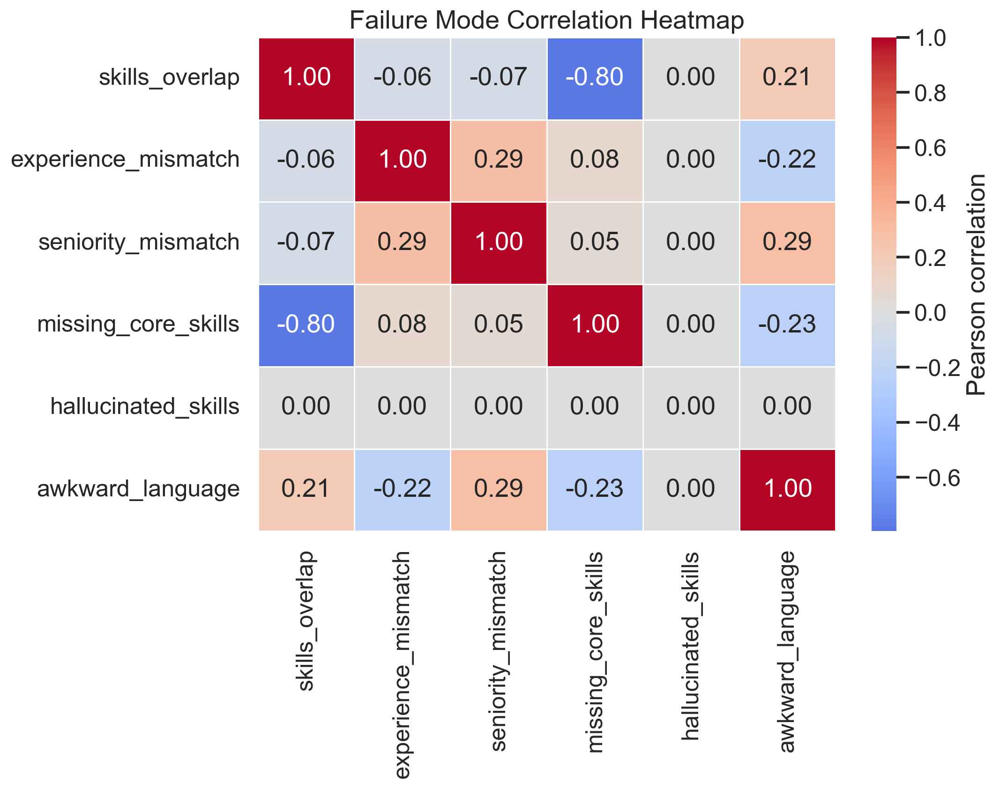
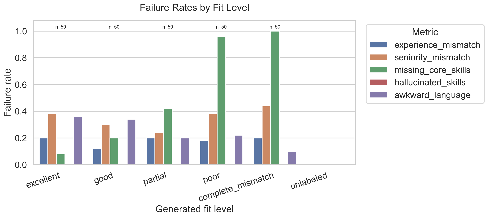
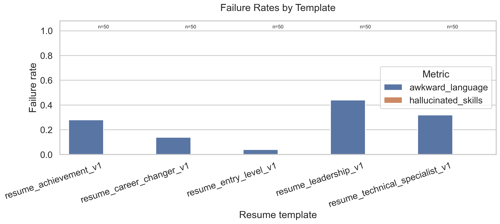
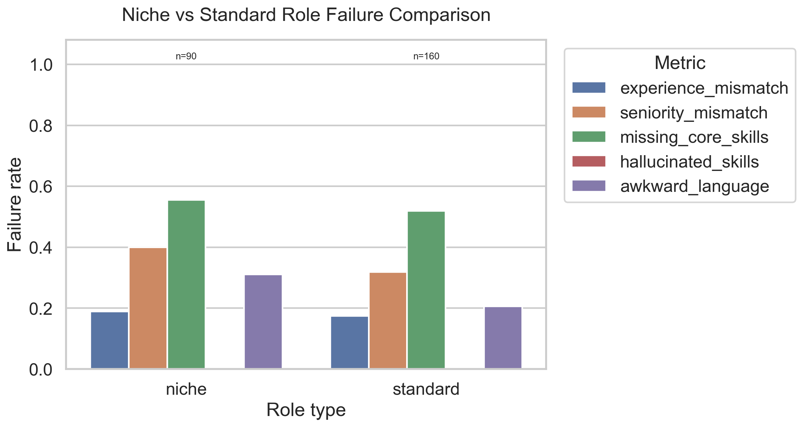
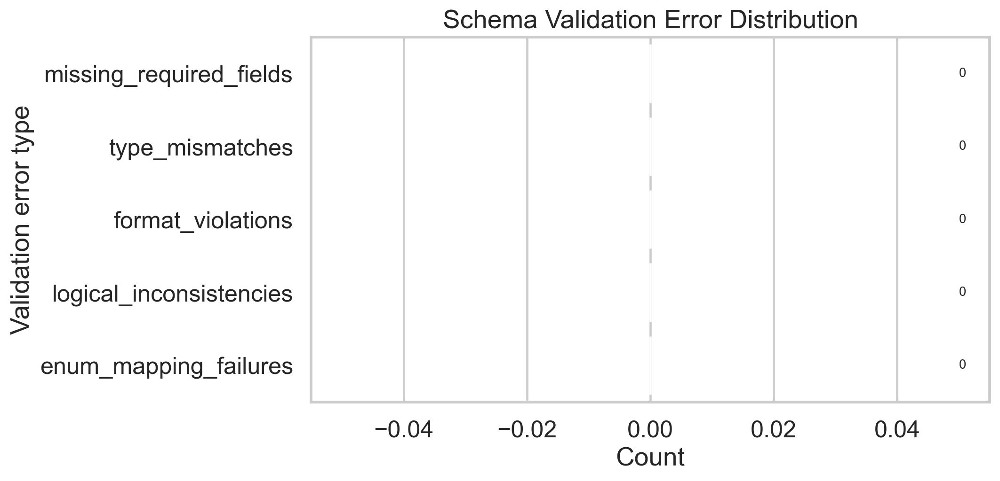

# Synthetic Data Pipeline

Production-style pipeline for generating synthetic job/resume datasets, validating quality, analyzing failure modes, and exposing review logic through an API.

## Overview

This project simulates a client workflow where synthetic data quality must be measurable, explainable, and operationally reliable.  
It combines data generation, validation, analysis, optional correction, and API benchmarking into one reproducible pipeline.

## Business Objective

- Generate realistic synthetic resume-job pairs at scale.
- Quantify quality issues through failure-mode analysis.
- Track latency and runtime metrics for operational readiness.
- Provide clear evidence artifacts (tables, charts, summaries) for stakeholder review.

## Client Impact

- Reduces manual review burden by surfacing common resume-job fit failures automatically.
- Provides decision-ready evidence (latency, failure rates, template quality) for stakeholders.
- Creates a repeatable baseline for improving template quality and correction performance over time.

## Solution Architecture

Pipeline stages:
1. Generation (`generator.py`)
2. Validation (`validator.py`)
3. Analysis (`analyzer.py`)
4. Correction (`corrector.py`, optional)
5. API Exposure (`api.py`)
6. Runtime Evidence (`benchmark_api.py`, `summarize_pipeline.py`, `metrics_report.py`, `visualizer.py`)

## Results Snapshot (Latest Evidence Run)

Based on artifacts generated in the latest completed run:
- Records generated: 50 jobs, 250 resumes, 250 pairs
- Validation success rate: 100%
- Rules-only API p95 latency: 0.016s (target: 2.0s, PASS)
- With-judge API p95 latency: 8.255s (target: 10.0s, PASS)
- Correction success rate: 0.0% (target: 50.0%, FAIL)

| Metric | Value | Target | Status |
|---|---:|---:|---|
| Rules-only p95 latency | 0.016s | 2.0s | PASS |
| With-judge p95 latency | 8.255s | 10.0s | PASS |
| Correction success rate | 0.0% | 50.0% | FAIL |

## Key Findings

- `missing_core_skills` is the most frequent failure class in current outputs.
- Strongest co-movement appears between `missing_core_skills` and `skills_overlap` (|r|=0.80).
- `poor` fit-level outputs have higher mean failure count than `good`.
- `resume_entry_level_v1` is currently the weakest template baseline.
- Niche roles show higher average failure burden than standard roles.

## Visual Evidence

### Failure Mode Correlation Heatmap


### Failure Rates by Fit Level


### Failure Rates by Template


### Niche vs Standard Failure Comparison


### Schema Error Distribution


## Quickstart

Run from `synthetic-data-pipeline/`.

### 1) Setup

```bash
python3 -m venv .venv
source .venv/bin/activate
pip install -r requirements.txt
cp .env.example .env.local
```

Then edit `.env.local` with your actual environment values.

### 2) Happy Path Pipeline Run

```bash
python generator.py --num-jobs 50 --resumes-per-job 5 --niche-ratio 0.2 --seed 42 --output-dir data/generated
python validator.py --input-dir data/generated --output-dir outputs/validation
python analyzer.py --validated-data-json outputs/validation/validated_data_<timestamp>.json --output-dir outputs/analysis
python corrector.py --validation-dir outputs/validation --output-dir outputs/corrections
uvicorn api:app --reload --port 8000
```

API docs: `http://localhost:8000/docs`

### Minimal API Example

```bash
curl -X POST "http://127.0.0.1:8000/review-resume" \
  -H "Content-Type: application/json" \
  -d @tests/fixtures/control_pairs_v1_first_record.json
```

Expected shape (abbreviated):
```json
{
  "overall_decision": "pass_or_review",
  "failure_labels": ["missing_core_skills", "seniority_mismatch"],
  "notes": "..."
}
```

## Operational Evidence Run

Use this flow when you need runtime evidence artifacts (stage timing, API latency, summary report, charts):

```bash
python capture_stage_time.py --stage generation --times-json outputs/stage_times.json -- \
  python generator.py --num-jobs 50 --resumes-per-job 5 --niche-ratio 0.2 --seed 42 --output-dir data/generated

python capture_stage_time.py --stage validation --times-json outputs/stage_times.json -- \
  python validator.py --input-dir data/generated --output-dir outputs/validation

python capture_stage_time.py --stage analysis --times-json outputs/stage_times.json -- \
  python analyzer.py --validated-data-json outputs/validation/validated_data_<timestamp>.json --output-dir outputs/analysis

python capture_stage_time.py --stage correction --times-json outputs/stage_times.json -- \
  python corrector.py --validation-dir outputs/validation --output-dir outputs/corrections

uvicorn api:app --reload --port 8000
python benchmark_api.py --requests-per-mode 10
python summarize_pipeline.py --stage-times-json outputs/stage_times.json
python metrics_report.py
python visualizer.py
```

## Limitations and Next Iteration

**Current limitations**
- Correction effectiveness is not meaningfully measured in this run because there were no materially invalid records requiring repair.
- Template-specific quality variance remains.
- Benchmarks currently center on one fixture profile.

**Next iteration**
- Tune weaker resume templates (starting with entry-level variants).
- Expand benchmark payload diversity beyond the current control fixture.

## Reference Docs

- Detailed commands and workflow: [`_runbook.md`](./_runbook.md)
- Runtime metrics and benchmarking: [`_metrics.md`](./_metrics.md)
- Artifact interpretation guide: [`_artifact_interpretation.md`](./_artifact_interpretation.md)
- Advanced LLM-as-Judge notes: [`_advanced_reference.md`](./_advanced_reference.md)